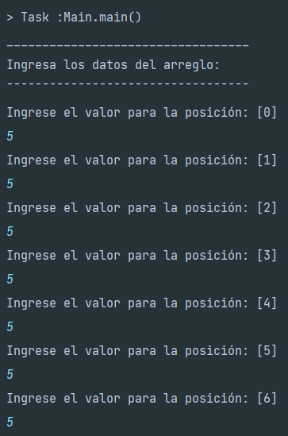
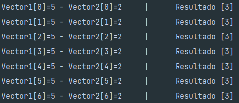
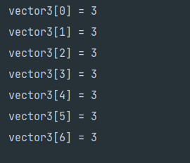
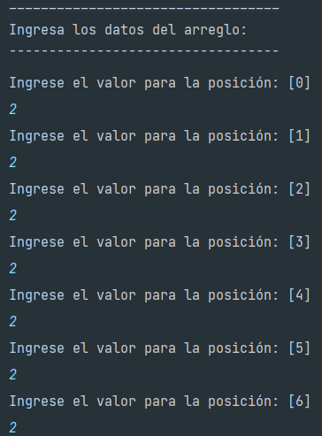
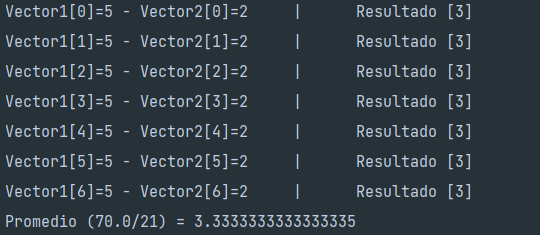

# ArreglosIUDigital - Operaciones con Vectores

Este proyecto es una aplicación de consola desarrollada en **Java** que demuestra el manejo de arreglos unidimensionales, captura de datos dinámica, cálculos aritméticos y manipulación de índices.

## 🎯 Objetivo del Proyecto
El programa tiene como finalidad cumplir con los siguientes requerimientos lógicos:
1.  **Definir y llenar** dos arreglos unidimensionales de 7 posiciones cada uno con datos ingresados por el usuario.
2.  **Calcular la diferencia** entre los elementos de los dos primeros arreglos y almacenar el resultado en un tercer arreglo.
3.  **Calcular el promedio global** de todos los datos procesados (21 valores en total: 14 ingresados y 7 calculados).
4.  **Visualizar** de forma clara los resultados obtenidos en el tercer arreglo y el proceso de resta.

## 🚀 Instrucciones de Ejecución

### Requisitos previos
*   Tener instalado el **JDK (Java Development Kit)** versión 8 o superior.
*   Un IDE (IntelliJ IDEA, Eclipse, NetBeans) o la terminal de comandos.

### Pasos para ejecutar
1.  **Clonar el repositorio:**
    ```bash
    git clone https://github.com/meli0720/ArreglosIUDigital.git
    ```
2.  **Navegar a la carpeta del proyecto:**
    ```bash
    cd Arreglos
    ```
3.  **Compilar el programa:**
    ```bash
    javac src/main/java/org/example/Main.java
    ```
4.  **Ejecutar:**
    ```bash
    java org.example.Main
    ```

## 📸 Capturas de Pantalla de la Ejecución

A continuación se muestra el flujo del programa en consola:

> **Nota:** Para que las imágenes se vean aquí, debes subir las capturas a una carpeta llamada `img` en tu repositorio y ajustar la ruta.


| Proceso de Ingreso                                             | Cálculo de Diferencias | Resultado Final |
|:---------------------------------------------------------------| :--- | :--- |
|                                             |  |  |
|  |   |

## 👥 Contribuyentes (Integrantes)
Proyecto desarrollado por:

*   **Melissa Meneses Acevedo** - [GitHub Profile](https://github.com/meli0720)

---
*Este proyecto fue realizado para la asignatura de Estructuras de datos.*
